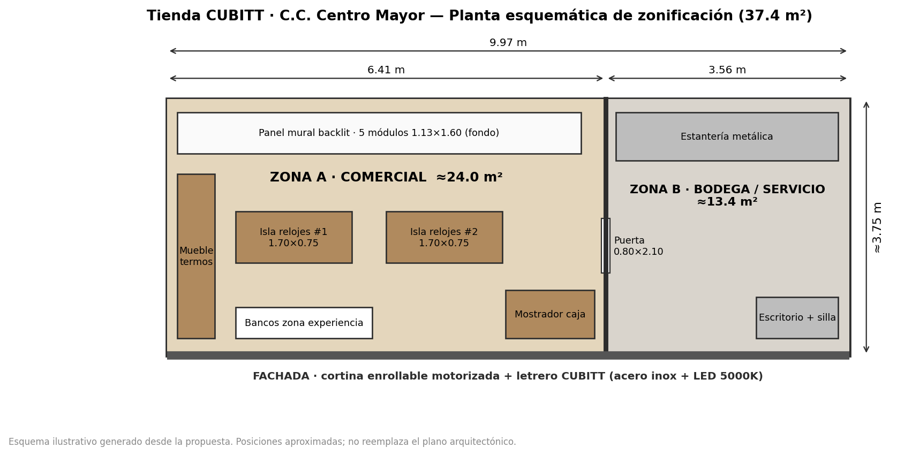
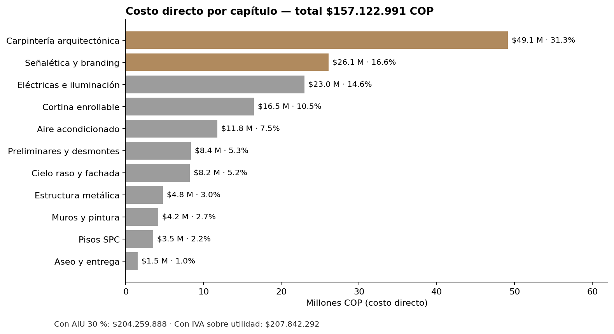
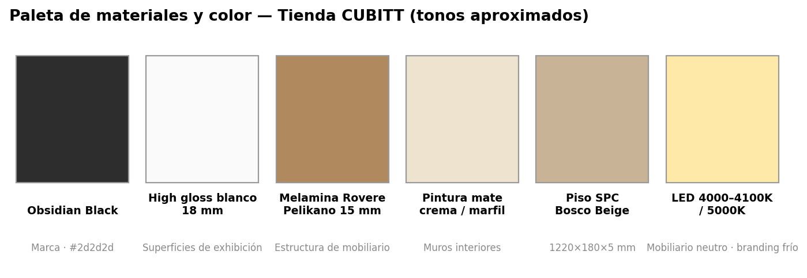
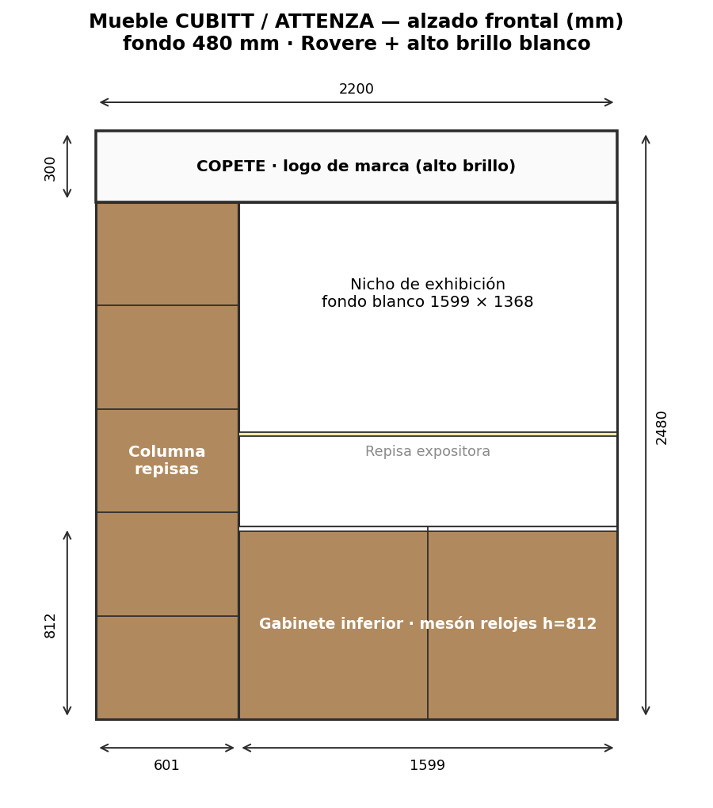
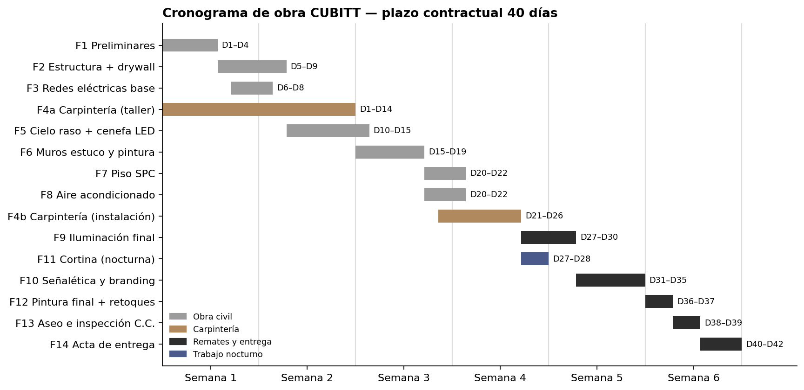
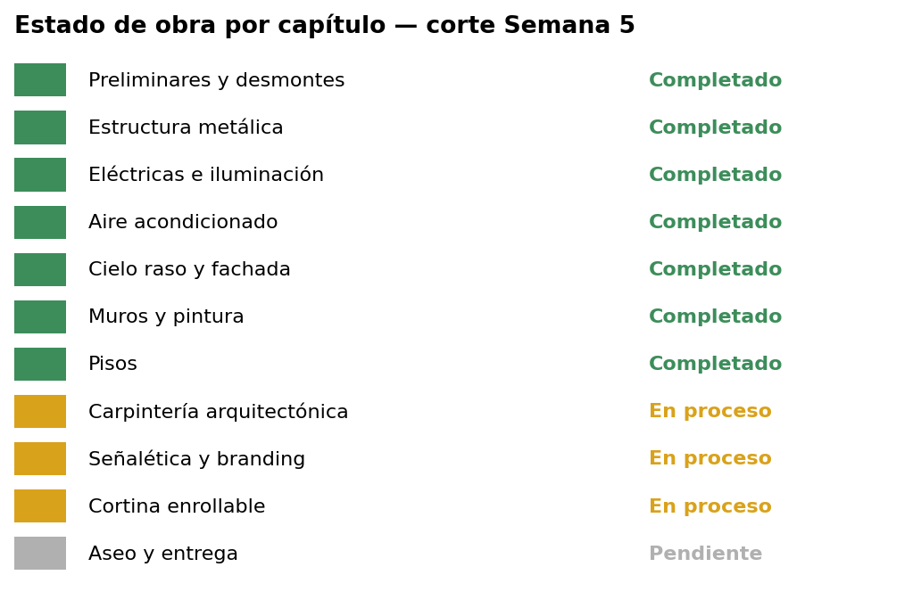

# CUBBIT — Propuesta Tienda CUBITT · C.C. Centro Mayor (Bogotá)



> **Nuevo · Propuesta de mobiliario 2027 «Línea Platino» (FARUK AGENCIA):** sitio en [`index.html`](index.html) con escena 3D interactiva, planos cenitales de producto, mueble Cubitt Jr & Teens, renders Higgsfield y artes reales de Cubitt. Ficha técnica en [`propuesta-2027/PROPUESTA.md`](propuesta-2027/PROPUESTA.md).

> Repositorio de referencia del proyecto de adecuación del local comercial **CUBITT** (tecnología y accesorios, línea smartwatch **VIVA PRO 2**), elaborado por **FARUK AGENCIA — Inversiones Rahman SAS** / **BAE Group**. Consolida la propuesta económica, alcance por capítulos, cronograma, estado de obra e imágenes de marca.

---

## Índice

1. [Datos generales](#1-datos-generales)
2. [Resumen financiero](#2-resumen-financiero)
3. [Distribución del local](#3-distribución-del-local)
4. [Alcance por capítulos](#4-alcance-por-capítulos)
5. [Concepto de diseño y materiales](#5-concepto-de-diseño-y-materiales)
6. [Imágenes de referencia CUBITT](#6-imágenes-de-referencia-cubitt)
7. [Cronograma de obra](#7-cronograma-de-obra)
8. [Estado de ejecución (Semanas 1–5)](#8-estado-de-ejecución-semanas-15)
9. [Cambios de alcance y pendientes](#9-cambios-de-alcance-y-pendientes)
10. [Documentos fuente](#10-documentos-fuente)
11. [Estructura del repositorio](#11-estructura-del-repositorio)

---

## 1. Datos generales

| Campo | Detalle |
|---|---|
| **Proyecto** | CUBITT — Tienda Retail · Tecnología y Accesorios |
| **Marca** | CUBITT (línea smartwatch VIVA PRO 2) |
| **Ubicación** | C.C. Centro Mayor, Autopista Sur, Bogotá D.C. |
| **Área neta** | 37,4 m² (frente 9,97 m × fondo ≈ 3,75 m) |
| **Zona comercial** | ≈ 24,0 m² (frente 6,41 m) |
| **Zona bodega / servicio** | ≈ 13,4 m² (frente 3,56 m) |
| **Plazo** | 40 días calendario (≈ 6 semanas) |
| **Modalidad** | Horario mixto: nocturno (demolición / soldadura) + diurno (acabados) |
| **Normativa** | Protocolo C.C. Centro Mayor · NSR-10 · referencias CAMACOL |
| **Elaborado por** | FARUK AGENCIA — Inversiones Rahman SAS |
| **Fecha propuesta** | Junio 2026 |
| **Garantía** | 12 meses sobre obra ejecutada |

---

## 2. Resumen financiero

| Concepto | % | Valor (COP) |
|---|---:|---:|
| **Costo directo total** | — | **$ 157.122.991** |
| AIU — Administración | 10 % | $ 15.712.299 |
| AIU — Imprevistos | 8 % | $ 12.569.839 |
| AIU — Utilidad | 12 % | $ 18.854.759 |
| **Valor total propuesta (AIU 30 %)** | | **$ 204.259.888** |
| IVA sobre utilidad | 19 % | $ 3.582.404 |
| **VALOR TOTAL CON IVA** | | **$ 207.842.292** |

> Precios con mano de obra, materiales y equipos según APU 2026 (CONSTRUDATA / CAMACOL).

### Peso por capítulo (costo directo)

| # | Capítulo | Valor (COP) | % |
|---:|---|---:|---:|
| 1 | Preliminares — Desmontes | 8.372.500 | 5,3 % |
| 2 | Estructura metálica y divisiones | 4.776.000 | 3,0 % |
| 3 | **Carpintería arquitectónica** | **49.138.472** | **31,3 %** |
| 4 | Cielo raso y fachada | 8.220.660 | 5,2 % |
| 5 | Pisos — SPC + guardaescoba | 3.523.500 | 2,2 % |
| 6 | Muros, enchapes y pintura | 4.191.859 | 2,7 % |
| 7 | Instalaciones eléctricas e iluminación | 22.988.000 | 14,6 % |
| 8 | Aire acondicionado | 11.800.000 | 7,5 % |
| 9 | **Señalética y branding** | **26.082.000** | **16,6 %** |
| 10 | Aseo y entrega | 1.530.000 | 1,0 % |
| 11 | Cortina enrollable de seguridad | 16.500.000 | 10,5 % |
| | **Total** | **157.122.991** | **100 %** |



---

## 3. Distribución del local

| Zona | Uso | Frente | Área |
|---|---|---:|---:|
| **A — Comercial** | Exhibición y atención al cliente | 6,41 m | ≈ 24,0 m² |
| **B — Bodega / Servicio** | Almacenamiento, servicio y escritorio de operación | 3,56 m | ≈ 13,4 m² |
| **Total** | | **9,97 m** | **37,4 m²** |


**Elementos por zona:** fachada con cortina enrollable y letrero CUBITT → zona comercial (islas de relojes #1 y #2, panel mural backlit de 5 módulos, mostrador de caja, mueble de termos, bancos de experiencia) → muro divisorio con puerta 0,80 × 2,10 m → bodega (estantería metálica, escritorio y silla).

---

## 4. Alcance por capítulos

### Cap. 1 — Preliminares y desmontes · $ 8.372.500

| Ítem | Descripción | UM | Cant. | Vr. unit. | Vr. total |
|---|---|---|---:|---:|---:|
| 1.1 | Desmonte y retiro de acabados (piso, cielo, paredes, aluminio y vidrio fachada) · horario nocturno | m² | 33 | 36.500 | 1.204.500 |
| 1.2 | Limpieza y descapote inicial según protocolo C.C. | m² | 33 | 25.000 | 825.000 |
| 1.3 | Trazado y replanteo arquitectónico | m² | 33 | 15.000 | 495.000 |
| 1.4 | Cerramiento de obra en yeso ½" + señalización + puerta drywall | GL | 1 | 2.348.000 | 2.348.000 |
| 1.5 | Pólizas, permisos y coordinación horarios nocturnos con el C.C. | GL | 1 | 3.500.000 | 3.500.000 |

### Cap. 2 — Estructura metálica y divisiones · $ 4.776.000

| Ítem | Descripción | UM | Cant. | Vr. unit. | Vr. total |
|---|---|---|---:|---:|---:|
| 3.2.1 | Estructura cielo raso modulado, perfil C 1" × 0,9 mm, módulo 0,60 × 0,60 | m² | 30 | 75.000 | 2.250.000 |
| 3.2.2 | Drywall divisorio bodega, perfil C 3‑5/8", h = 2,80 m, doble placa RH | m² | 12 | 158.000 | 1.896.000 |
| 3.2.4 | Anclajes Hilti + platinas + carga suspendida | UN | 30 | 21.000 | 630.000 |

### Cap. 3 — Carpintería arquitectónica · $ 49.138.472

| Ítem | Descripción | UM | Cant. | Vr. unit. | Vr. total |
|---|---|---|---:|---:|---:|
| 1.3.1 | Isla exhibición relojes #1 — 1,70 × 0,75 m, Rovere Pelikano + high gloss + LED 4100K + herraje c/llave | UN | 1 | 3.900.000 | 3.900.000 |
| 1.3.2 | Isla exhibición relojes #2 — ídem | UN | 1 | 3.900.000 | 3.900.000 |
| 1.3.3 | Panel mural backlit 5 módulos — high gloss blanco + LED 4000K 1,13 × 1,60 m | UN | 5 | 2.500.000 | 12.500.000 |
| 1.3.4 | Mostrador caja registradora — Rovere Pelikano + cubierta high gloss 18 mm + LED + cajonería cierre lento | UN | 1 | 5.900.000 | 5.900.000 |
| 1.3.5 | Puerta acceso caja (mueble con almacenamiento) 0,50 × 0,90 m | UN | 1 | 1.250.000 | 1.250.000 |
| 1.3.6 | Mueble lateral para termos con estantería empotrada + iluminación indirecta 4100K | GL | 1 | 8.540.000 | 8.540.000 |
| 1.3.7 | Bancos blancos zona experiencia — acero lacado + polipiel, h = 0,75 m | UN | 2 | 720.000 | 1.440.000 |
| 1.3.8 | Muro divisorio con puerta a bodega 0,80 × 2,10 m + chapa magnética | UN | 1 | 4.753.472 | 4.753.472 |
| ESP. | Espejo decorativo zona exhibición | UN | 1 | 540.000 | 540.000 |
| 1.3.9 | Anclaje tipo cuchilla para estanterías flotantes | UN | 5 | 85.000 | 425.000 |
| 1.3.11 | Estantería metálica bodega | GL | 1 | 5.500.000 | 5.500.000 |
| 1.3.12 | Escritorio bodega | UN | 1 | 280.000 | 280.000 |
| 1.3.13 | Silla escritorio bodega | UN | 1 | 210.000 | 210.000 |

### Cap. 4 — Cielo raso y fachada · $ 8.220.660

| Ítem | Descripción | UM | Cant. | Vr. total |
|---|---|---|---:|---:|
| 1.4.1 | Placas de yeso ½" 1,22 × 2,44 m | UN | 13 | 604.500 |
| 1.4.2 | Estructura en aluminio cielo raso | m² | 30 | 258.000 |
| 1.4.3 | Estuco | kg | 46,35 | 259.560 |
| 1.4.4 | Pintura blanca | UN | 1 | 401.900 |
| 1.4.5 | **Cenefa backlit**: canal MDF perimetral + LED 24V (0,20 m) | ml | 28 | 5.600.000 |
| 1.4.6 | Dintel en yeso estucado y pintado | GL | 1 | 1.070.000 |
| 1.4.7 | Refuerzo drywall con listones 8 × 4 cm | ml | 3 | 26.700 |

### Cap. 5 — Pisos SPC + guardaescoba · $ 3.523.500

| Ítem | Descripción | UM | Cant. | Vr. total |
|---|---|---|---:|---:|
| 1.5.1 | Piso SPC **Bosco Beige** 1220 × 180 × 5 mm + nivelación | m² | 30,9 | 2.935.500 |
| 1.5.2 | Guardaescoba SPC h = 0,08 m | ml | 24,5 | 588.000 |

### Cap. 6 — Muros, enchapes y pintura · $ 4.191.859

| Ítem | Descripción | UM | Cant. | Vr. total |
|---|---|---|---:|---:|
| 1.6.1 | Pintura premium mate tono crema / marfil | m² | 161,34 | 2.339.430 |
| 1.6.2 | Estuco plástico ESTUCOR | m² | 80,67 | 701.829 |
| 1.6.4 | Muro divisorio zona servicio en yeso | m² | 5,23 | 1.150.600 |

### Cap. 7 — Instalaciones eléctricas e iluminación · $ 22.988.000

| Ítem | Descripción | UM | Cant. | Vr. total |
|---|---|---|---:|---:|
| 1.7.1a | Acometida trifásica Cu 3×No.2 + 1×No.4 AWG (EMT 2") | ml | 24,94 | 4.988.000 |
| 1.7.1b | Tablero trifásico 24 circuitos | GL | 1 | 580.000 |
| 1.7.2 | Cinta LED de incrustar 24W neutra | ml | 16 | 3.280.000 |
| 1.7.3 | Riel magnético con reflectores, proyectores y barras | UN | 6 | 5.100.000 |
| 1.7.4 | Perfil empotrado doble cinta LED 4000K | UN | 6 | 3.450.000 |
| 1.7.5 | Tomacorrientes | pto | 12 | 1.260.000 |
| 1.7.6 | Salidas de iluminación | pto | 6 | 1.230.000 |
| 1.7.7 | Sistema de sonido en cielo raso (control + bafles) | GL | 1 | 3.100.000 |

### Cap. 8 — Aire acondicionado · $ 11.800.000

| Ítem | Descripción | UM | Cant. | Vr. total |
|---|---|---|---:|---:|
| 8.1.1 | Equipo A/C 18.000–24.000 BTU + ductos de ventilación, instalación completa | GL | 1 | 11.800.000 |

### Cap. 9 — Señalética y branding · $ 26.082.000

| Ítem | Descripción | UM | Cant. | Vr. total |
|---|---|---|---:|---:|
| 1.9.3b | Letrero principal CUBITT en cenefa acero inoxidable — acrílico + LED 5000K | GL | 1 | 2.450.000 |
| 1.9.3c | Bolsillos de acrílico | UN | 16 | 320.000 |
| 1.9.6 | Videowall LED 1,65 × 3,50 m *(reemplazado por caja de luz — ver §9)* | UN | 1 | 10.250.000 |
| 1.9.7 | Cableado y gestión de contenido videowall | UN | 1 | 450.000 |
| 1.9.8 | Logo CUBITT superior — acrílico opaco 3 mm + luz 5000K | UN | 1 | 380.000 |
| 1.9.9 | TV 70" | UN | 1 | 4.200.000 |
| 1.9.10 | Soporte audífonos — base mesa | UN | 3 | 255.000 |
| 1.9.11 | Soporte audífonos — base pared | UN | 3 | 135.000 |
| 1.9.12 | Base bafles (Power Pro / Plus / Go) — acrílico blanco | UN | 3 | 66.000 |
| 1.9.13 | Base Power Buds — caja acrílica + tornillo de seguridad | UN | 6 | 480.000 |
| 1.9.14 | Base relojes en mesa — acrílico blanco | UN | 8 | 136.000 |
| 1.9.15 | Soporte para básculas | UN | 2 | 90.000 |
| CL3 | Caja de luz superior recepción 1022 × 2750 mm | UN | 1 | 2.000.000 |
| CL4 | Caja de luz tipo 2 — 925 × 930 mm | UN | 3 | 2.340.000 |
| CL5 | Caja de luz superior muro izquierdo 1560 × 1050 mm | UN | 1 | 1.950.000 |
| CL6 | Caja de luz tipo 1 — 925 × 450 mm | UN | 1 | 580.000 |

### Cap. 10 — Aseo y entrega · $ 1.530.000

| Ítem | Descripción | Vr. total |
|---|---|---:|
| 1.11.1 | Limpieza post‑obra especializada (protocolo C.C.) | 750.000 |
| 1.11.2 | Retoques finales y correcciones menores | 780.000 |

### Cap. 11 — Cortina enrollable de seguridad · $ 16.500.000

| Ítem | Descripción | Vr. total |
|---|---|---:|
| 11.1 | Cortina en lama de acero galvanizado microperforado cal. 22/20, pintura electrostática, guías con cinta antirruido | 12.500.000 |
| 11.2 | Motor lateral 600 kg (110/220V), kit de emergencia por cadena, central + 2 controles | 2.200.000 |
| 11.3 | Instalación nocturna con cuadrilla certificada en alturas, izaje y calibración | 1.800.000 |

---

## 5. Concepto de diseño y materiales

| Elemento | Especificación |
|---|---|
| **Madera base** | Melamina **Rovere Pelikano** 15 mm (reengruesada, canto rígido) |
| **Superficies de exhibición** | Lámina **high gloss blanca** 18 mm |
| **Iluminación de mobiliario** | LED 4000–4100K (neutra) en bases, perfiles y nichos |
| **Branding** | Letras y logo en acrílico con LED 5000K, cajas de luz backlit |
| **Cielo** | Yeso blanco + cenefa perimetral backlit LED 24V |
| **Muros** | Pintura mate crema / marfil sobre estuco plástico |
| **Piso** | SPC Bosco Beige, junta mínima |
| **Fachada** | Cortina enrollable microperforada motorizada |



**Mueble CUBITT / ATTENZA** (cotización sep‑2026): 2.200 mm ancho × 2.480 mm alto × 480 mm fondo · copete con logo 300 mm · columna izquierda 601 mm · módulo derecho 1.599 mm · base 812 mm · acabado alto brillo en caras vistas.



---

## 6. Imágenes de referencia CUBITT

### Imágenes del proyecto (incluidas en `assets/`)

| Archivo | Contenido |
|---|---|
| `assets/01-plano-zonificacion.png` | Planta esquemática: zonas A/B, cotas y mobiliario |
| `assets/02-costos-por-capitulo.png` | Costo directo por capítulo con % de participación |
| `assets/03-cronograma.png` | Diagrama de Gantt por fases (D1–D42) |
| `assets/04-mueble-attenza-alzado.png` | Alzado acotado del mueble CUBITT / ATTENZA |
| `assets/05-paleta-materiales.png` | Paleta de materiales y color de marca |
| `assets/06-estado-obra-s5.png` | Estado de cada capítulo al corte de la Semana 5 |
| `Cubitt_Logo_Full_black 2.png` | Logo oficial CUBITT (negro). Versión platino en `propuesta-2027/assets/logo/` |

> Las imágenes son esquemas generados a partir de la propuesta. No reemplazan los planos arquitectónicos ni los renders oficiales.

### Productos que exhibe el mobiliario

Referencias oficiales en [cubittofficial.com](https://cubittofficial.com) (enlaces, no se incluyen como archivo).

| Mobiliario (ítem) | Productos CUBITT | Referencia |
|---|---|---|
| Islas de relojes (1.3.1, 1.3.2) y bases acrílicas (1.9.14) | Smartwatches VIVA PRO 2, AURA 2, Hero Gen 4, TERRA | [Smartwatches](https://cubittofficial.com/collections/smartwatches) |
| Soportes de audífonos (1.9.10, 1.9.11) y bases Power Buds (1.9.13) | Power Headphones, Power Buds, Earbuds Pro | [Audífonos](https://cubittofficial.com/collections/headphones) |
| Bases para bafles (1.9.12) | Power Pro / Plus / Go Gen2 | [Parlantes](https://cubittofficial.com/collections/speakers) |
| Mueble lateral de termos (1.3.6) | Hydro Bottle, Tumbler, Travel Mug | [Termos](https://cubittofficial.com/collections/bottles) |
| Soporte para básculas (1.9.15) | Smart Scale, Smart Kitchen Scale | [Básculas](https://cubittofficial.com/collections/shop-scales) |

> Color de marca observado: *Obsidian Black* (#2d2d2d) con blanco. En el local se traduce en alto brillo blanco, madera Rovere y luz neutra.

### Renders y fotos del proyecto (Drive)

| Recurso | Enlace |
|---|---|
| Presupuesto con imágenes por ítem | [PPT CUBITT.xlsx](https://drive.google.com/file/d/1u9v9a2zdBbbmttk6RiHtl5SanKEfl3KY/view) |
| Mueble CUBITT (planos) | [Mueble para tienda Cubitt.pdf](https://drive.google.com/file/d/1K5NHbd5EugOrRrJJ03qAyiCRvdINIdcb/view) · [AA MUEBLE CUBITT.pdf](https://drive.google.com/file/d/1blNbUC6I0b0kkj7YWElZJCnPTsuRGIbI/view) |
| Caja registradora (variantes) | [Base](https://drive.google.com/file/d/1QnJHbJjpFh_0QjgktMxLaXufHYKA2bew/view) · [High gloss](https://drive.google.com/file/d/1iLcjPZoXRqQfqDXeE9KCcmwe9RYjcVPv/view) · [Fresno europeo](https://drive.google.com/file/d/1fP7h-sVnmfMRHZZHm6q4boaW4KGa9uVx/view) |
| Muestras de material | [High gloss 18 mm](https://drive.google.com/file/d/1tRecHxy6cBfM3aWZ_JHePdwNVg5Vn-2P/view) · [Madera blanca 15 mm](https://drive.google.com/file/d/1zk0P2-umP69pP8ZNPekfaFGJCvP9yHCz/view) |
| Registro fotográfico de obra | [Informe final](https://drive.google.com/file/d/1Q2EEEEJJk7xlVhDjvhZ4MMlChKYVYNUS/view) · [Recopilatorio S1–S5](https://drive.google.com/file/d/157Q6Af1ZfJRPRTanDNT4NNB-6NTKJXDZ/view) |

---

## 7. Cronograma de obra



> Nota: el documento de presupuesto indica "28 días" en el encabezado del cronograma, pero las fases llegan a D42 y los datos generales establecen **40 días calendario**. Conviene unificar este dato.

---

## 8. Estado de ejecución (Semanas 1–5)

| Semana | Foco | Hitos |
|---|---|---|
| **S1** | Demolición y alistamiento | Cerramiento, desmonte de vidrios de fachada, retiro de acabados, replanteo, medidas de cortina |
| **S2** | Estructura e instalaciones | Estructura metálica de muros, ductos de ventilación, compra de piso, anticipo Video Wall, inicio fabricación carpintería |
| **S3** | Acabados | Estuco y fondeo, cielo raso, refuerzo Video Wall, bodega terminada, **cortina enrollable instalada**, inicio de piso |
| **S4** | Acabados finales | Piso y pintura final, rieles y spots, llegada de muebles, reunión con directivos CUBITT, **cambio Video Wall → caja de luz** |
| **S5** | Carpintería y equipos | Montaje de mobiliario, corte de cajas de luz, planos de carpintería, cambio de LED, **contador de personas** instalado |

| Capítulo | Estado a S5 |
|---|---|
| Preliminares · Estructura · Eléctricas · Cielo raso · Muros · Pisos · A/C | ✅ Completado |
| Carpintería arquitectónica | 🟡 En proceso |
| Señalética y branding | 🟡 En proceso |
| Cortina enrollable | 🟡 Cierre económico y pintura in situ pendientes |
| Aseo y entrega | ⏳ Pendiente (Semana 6) |



---

## 9. Cambios de alcance y pendientes

**Cambio de alcance**
- **Video Wall LED (1,65 × 3,50 m) reemplazado por caja de luz** en fachada (Semana 4), alineada con las cajas de luz interiores. Impacta el Cap. 9.

**Pendientes para cierre**
- [ ] Finalizar montaje de carpintería y mobiliario (mayor peso presupuestal).
- [ ] Instalar cajas de luz definitivas y cerrar señalética / branding.
- [ ] Confirmar cierre de cortina enrollable (pintura in situ + vaselina industrial).
- [ ] Confirmar puesta en marcha y recibo del A/C / ventilación.
- [ ] Aseo final, inspección del C.C. y acta de entrega.

---

## 10. Documentos fuente

| Documento | Enlace |
|---|---|
| Presupuesto final actualizado (Doc) | [Google Docs](https://docs.google.com/document/d/1UlyHHy_d8hjbrfMBGmQNpPOpOjFTtJTHYfNfdPeD0lw/edit) |
| Presupuesto final actualizado (PDF) | [PDF](https://drive.google.com/file/d/1i9haBFbvtPVmvEevh9jkLKH7K9JAniFk/view) |
| Presupuesto FARUK Agencia (xlsx) | [XLSX](https://drive.google.com/file/d/15uW1aVK7MIgNYgDXyD3f7w_aA66pzQiJ/view) |
| Plan de ejecución de obra | [XLSX](https://drive.google.com/file/d/1nFSoZzw7AsIIncVofdGFw75Rqzi82euZ/view) |
| Cotización mueble CUBITT / ATTENZA | [XLSX](https://drive.google.com/file/d/1A4cWDG7J9Mmf-waI4syRdbvbihIie2ji/view) |
| Informe recopilatorio S1–S5 | [DOCX](https://drive.google.com/file/d/157Q6Af1ZfJRPRTanDNT4NNB-6NTKJXDZ/view) |
| Informe final de obra | [DOCX](https://drive.google.com/file/d/1Q2EEEEJJk7xlVhDjvhZ4MMlChKYVYNUS/view) |
| Carpeta del proyecto | [Drive · CUBBIT](https://drive.google.com/drive/folders/1u0RLst28N8HqUHR58IJ23jukPCDL0Xzf) |

---

## 11. Estructura del repositorio

```
CUBBIT/
├── README.md                    ← documento principal (este archivo)
├── AGENTS.md                    ← guía para agentes de IA (Codex y otros)
├── CLAUDE.md                    ← guía para Claude Code
├── assets/                      ← imágenes PNG del proyecto
├── data/presupuesto.csv         ← presupuesto ítem por ítem, legible por máquina
├── index.html                   ← sitio de la propuesta de mobiliario 2027
├── propuesta-2027/              ← sitio (CSS, JS three.js), renders, modelo 3D, artes Cubitt, firma y ficha PROPUESTA.md
└── tools/generar_imagenes.py    ← script que regenera las imágenes
```

---

_Confidencial — Uso exclusivo CUBITT / FARUK AGENCIA SAS · BAE Group · 2026_
